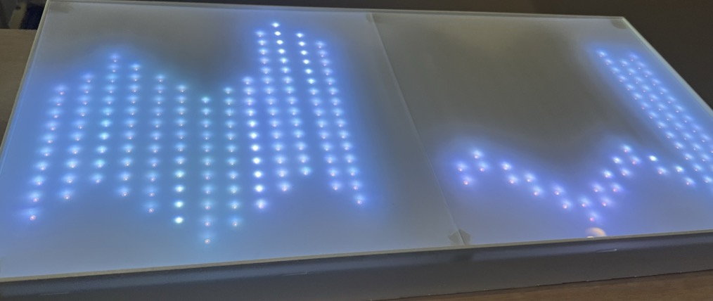

### README.md for Lumiverse Strip

#### Project Overview

The "Lumiverse Strip" is an advanced smart lighting system that utilizes WS2812B LED strips to create a dynamic and responsive environment within smart homes. This system integrates various functionalities such as voice control, music ambience lighting, environmental monitoring, motion detection, gesture and app-controlled text display, weather simulation, and circadian rhythm lighting. The purpose of this project is to demonstrate how smart lighting can enhance user interaction, adapt to environmental changes, and improve the overall quality of life in residential spaces.

#### Features

- **Voice Control**: Manage lighting settings via voice commands.
- **Music Ambience Lighting**: Sync lights with music for immersive experiences.
- **Environmental Monitoring**: Sensors that report real-time data such as temperature, humidity, and air quality.
- **Motion Detection**: Automated lighting adjustments based on detected movement.
- **Gesture and App-Controlled Text Display**: Display messages or alerts through gesture recognition or mobile app interactions.
- **Weather Simulation**: Simulate real-time weather conditions through lighting effects.
- **Circadian Rhythm Lighting**: Adjust lighting to align with natural circadian rhythms to support better sleep patterns and general well-being.

#### Modes

**Moving Mode**

**Music Mode**

**Environment Mode**

**Life Mode**

****

## How to Make It

### Hardware

* WS2812B LED Strip
* ESP32 Microcontroller
* HC-SR501 PIR Motion Sensors
* MAX9814 Audio Amplifier
* DF2301QG Voice Recognition Module
* BME680 Environmental Sensor
* APDS-9960 Gesture Recognition Sensor
* Power Supply (5V 15A recommended)
* Acrylic sheets (for enclosures)
* Wires, resistors, and other standard electronics components

####  Cut the Enclosures 

* Use a laser cutter to cut 3mm acrylic sheets according to the stored file (path: `./dxf/file_name.dxf`). The names of files represent which part they are belong to.
  * Sensor Box:
    * 
  * Led Box:
    * 

### Assemble the Hardware

1. **Sensor Box Assembly:**

   * Assemble the circuit according to the circuit diagram
     * 
     * Arrange the WS2812B LED strips in a wavy pattern, aligning with the height differences between the columns.
     * Route the wires (VCC, GND, and data) through the holes in the "MIDDLE" panel and secure them between the "MIDDLE" and "BOTTOM" layers.

   - Insert the PIR sensors into the designated holes in the "MIDDLE" panel.
   - Place the APDS-9960 sensor and the BME680 sensor into their respective slots.
   - Assemble the panels according to the labels, ensuring the correct orientation of each component.

2. **LED Box Assembly:**

   * Assemble the circuit according to the circuit diagram

     * 

     * Connect the WS2812B LED strips to the microcontroller (Adafruit Feather M0) and ensure the power supply is sufficient to drive the entire strip.

       Connect the BME680 and DF2301QG modules to the microcontroller using I2C and UART, respectively.

   - Arrange the WS2812B LED strips in a wavy pattern, aligning with the height differences between the columns.
   - Route the wires (VCC, GND, and data) through the holes in the "MIDDLE" panel and secure them between the "MIDDLE" and "BOTTOM" layers.
   - Attach the "TOP" panel made of semi-transparent acrylic.

****

 ## Program the Microcontrollers 

**1. Setup Development Environment:**

- Install the necessary libraries for ESP32 and Adafruit Feather M0 on your development environment (e.g., Arduino IDE).
- Clone the repository and upload the provided code(path: `./Arduino/...`) to the respective microcontrollers.
  - `led` folder is provided to Adafruit Feather M0 WiFi (LED Box)
  - `Moving` folder is provided to ESP32 (Sensor Box)
  - `nano` folder is provided to Arduino nano 33 BLE (if you don't have a single APDS-9600, you can use this one)

**2. Configure MQTT:**

- Set up an MQTT broker (e.g., Mosquitto) and configure the microcontrollers to communicate via MQTT for sensor data transmission and LED control.

**3. Test Functionality:**

- Power on the system and verify that each function (e.g., motion detection, voice control, music synchronization) operates as expected.
- Troubleshoot any issues, such as incorrect sensor readings or LED behavior.

****

### Deploy and Enjoy

1. **Deploy the System:**
   - Place the Sensor Box and LED Box in their designated locations within your smart home environment.
   - Ensure they are connected to your home network and the MQTT broker is running smoothly.
2. **Customize and Expand:**
   - Customize the settings via the provided app or adjust the code to better suit your environment.
   - Consider expanding the system with additional sensors or integrating it with other smart home devices.

****

## Flowchart

Here are some flowcharts of the design of the code:

* 
* 
* 
* 
* 
* 
* 

****

## APP

Download apk [here](https://github.com/Hazzd12/dissertation_2024/releases/tag/v1.2.43)

